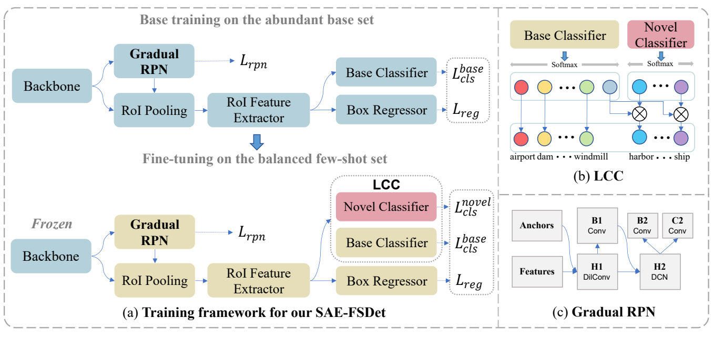

# Few-Shot Object Detection in Remote Sensing Images via Label-Consistent Classifier and Gradual Regression
Code for reproducing the results in our TGRS-2024 paper [Few-Shot Object Detection in Remote Sensing Images via Label-Consistent Classifier and Gradual Regression](https://ieeexplore.ieee.org/document/10445268). Our code is based on the open-source project [mmfewshot](https://github.com/open-mmlab/mmfewshot).
<p align=center></p>

## Requirements
+ python packages
    + Python 3.8
    + torch 2.0.0
    + mmcv-full 1.6.0
    + mmdet 2.27.0
    + mmcls 0.25.0
    + yapf 0.4.1
+ CUDA 11.8

## Installation
Run following shell commands to prepare the running enviroments.
```Shell
conda create -n SAE-FSDet python=3.8
conda activate SAE-FSDet
# install pytorch
pip install torch==2.0.0 torchvision==0.15.1 torchaudio==2.0.1 --index-url https://download.pytorch.org/whl/cu118
# install mmcv-full mmdet mmcls
pip install openmim
mim install mmcv-full==1.6.0
mim install mmdet==2.27.0
mim install mmcls==0.25.0
# clone SAE-FSDet repo
git clone https://github.com/YanxingLiu/SAE-FSDet.git
cd SAE-FSDet
pip install -r requirements.txt
pip install -v -e .
```
## Dataset Preparation
All the data are organized in data folder. The data folder layout should look like this.data<br>
data<br>
├── DIOR<br>
├── NWPU VHR-10 dataset<br>
└── few_shot_ann<br>
### DIOR dataset
For DIOR dataset, you can download DIOR dataset from its official [website](http://www.escience.cn/people/JunweiHan/DIOR.html) and prepare the data folder like this.data<br>
DIOR<br>
├── Annotations<br>
│   ├──00001.xml<br>
│   ├──00002.xml<br>
│   ├──*.xml<br>
├── ImageSets<br>
│   ├──Main<br>
│   │   ├── train.txt<br>
│   │   ├── val.txt<br>
│   │   ├── trainval.txt<br>
│   │   ├── test.txt<br>
├── JPEGImages<br>
└──     *.jpg<br>

### NWPU VHR-10 dataset
For NWPU VHR-10 dataset, you can download it from [here](https://gcheng-nwpu.github.io/).The original dataset was not divided into training and validation sets. As a result, we uploaded our train/val splits in data/NWPU VHR-10 dataset/Main. The final folder layout should look like this. data<br>
NWPU VHR-10 dataset<br>
├── ground truth<br>
├── Main<br>
├── negative image set<br>
├── positive image set<br>
└── readme.txt<br>
### Few-shot annotations
The few_shot_ann is our few-shot data splits. You can unzip the few_shot_ann.zip in data folder and the final layout will be look like this.
few_shot_ann<br>
├── dior<br>
│   ├── benchmark_10shot<br>
│   ├── benchmark_1shot<br>
│   ├── benchmark_20shot<br>
│   ├── benchmark_2shot<br>
│   ├── benchmark_3shot<br>
│   └── benchmark_5shot<br>
└── vhr10<br>
    ├── benchmark_10shot<br>
    ├── benchmark_20shot<br>
    ├── benchmark_3shot<br>
    └── benchmark_5shot<br>


## Getting Started
### Train a model
Base trianing:
```Shell
# Single gpu
python tools/detection/train.py configs/detection/SAE-FSDet/dior/split1/SAE-FSDet_r101_fpn_dior-split1_base-training.py
# multi gpu
bash tools/detection/dist_train.sh configs/detection/SAE-FSDet/dior/split1/SAE-FSDet_r101_fpn_dior-split1_base-training.py ${GPU_NUM}
```
Fine-tuning:
```
# Single gpu
python tools/detection/train.py configs/detection/SAE-FSDet/dior/split1/SAE-FSDet_r101_fpn_dior-split1_20shot_finetuning.py 
# multi gpu
bash tools/detection/dist_train.sh configs/detection/SAE-FSDet/dior/split1/SAE-FSDet_r101_fpn_dior-split1_20shot_finetuning.py ${GPU_NUM}
```
Note that if you use multi gpus, you should modify the learning rate and training iters based on [Accurate, Large Minibatch SGD: Training ImageNet in 1 Hour](https://arxiv.org/abs/1706.02677). All of our experiments are running in a single gpu.
### Test a model
You can test a trained model by using the following commands:
```Shell
# Single gpu
python tools/detection/test.py ${CONFIG_FILE} ${CHECKPOINT_FILE} --eval mAP
# Multi gpu
bash tools/detection/dist_test.sh ${CONFIG_FILE} ${CHECKPOINT_FILE} ${GPU_NUM} --eval mAP
```
For example, test the performance of 20-shot model.
```Shell
python tools/detection/test.py configs/detection/SAE-FSDet/dior/split1/SAE-FSDet_r101_fpn_dior-split1_20shot_finetuning.py \
        models/SAE-FSDet_r101_fpn_dior-split1_20shot_finetuning/latest.pth \
        --eval mAP
```
## Acknowledgement
This repo is based on the open-source [mmfewshot](https://github.com/open-mmlab/mmfewshot) project that is contributed by researchers and engineers from various colleges and companies. We appreciate all the contributors who implement their methods or add new features of mmfewshot.

## Citation
```
@ARTICLE{10445268,
  author={Liu, Yanxing and Pan, Zongxu and Yang, Jianwei and Zhang, Bingchen and Zhou, Guangyao and Hu, Yuxin and Ye, Qixiang},
  journal={IEEE Transactions on Geoscience and Remote Sensing}, 
  title={Few-Shot Object Detection in Remote Sensing Images via Label-Consistent Classifier and Gradual Regression}, 
  year={2024},
  volume={},
  number={},
  pages={1-1},
  keywords={Detectors;Remote sensing;Feature extraction;Proposals;Training;Object detection;Shape;Few-shot learning;object detection;remote sensing images;transfer-learning},
  doi={10.1109/TGRS.2024.3369666}}

```
